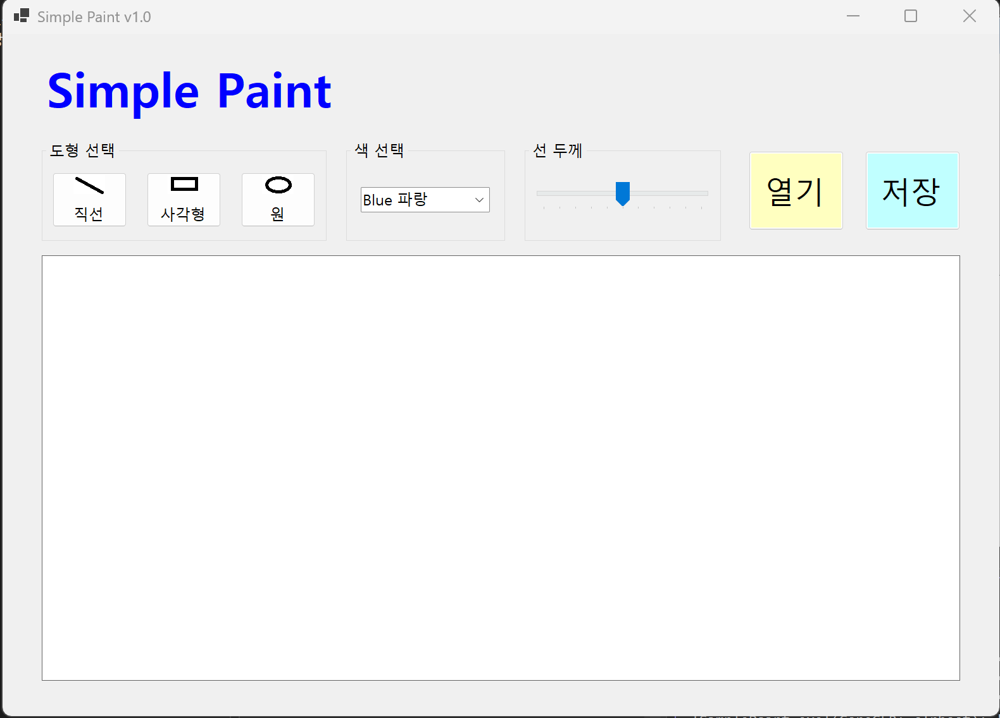
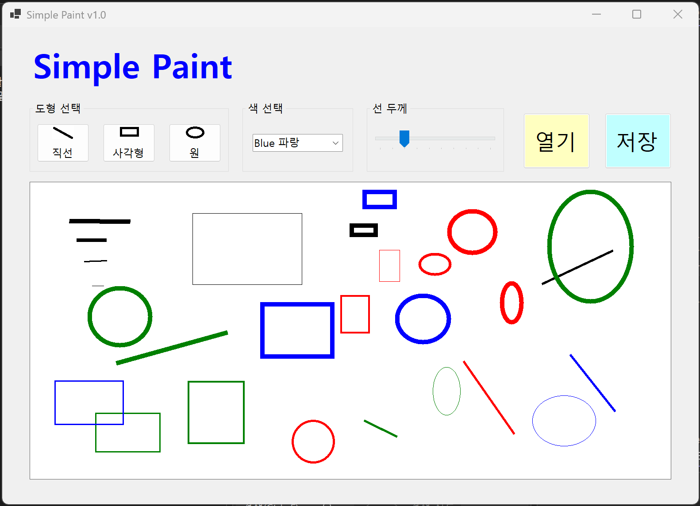
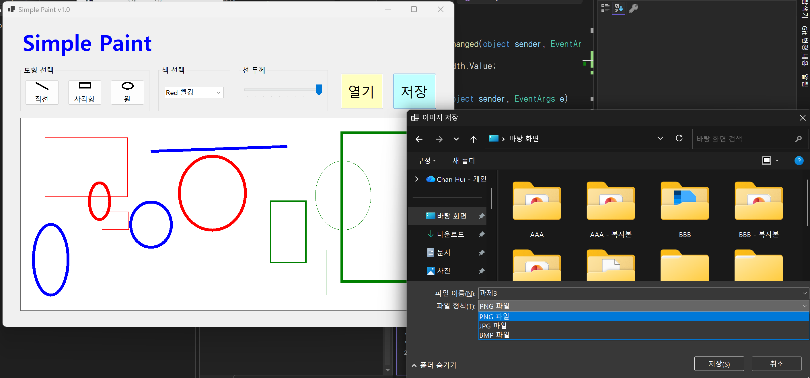
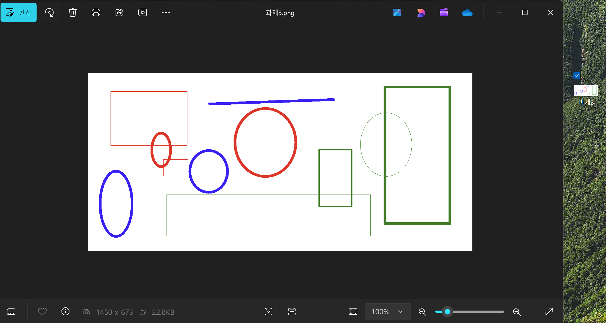

# (C# 코딩) 그림판 (SimplePaint)
## 개요
- C# 프로그래밍 학습
- 1줄 소개: 직선, 사각형, 원을 그리는 그림판 프로그램
- 사용한 플랫폼: 
  - C#, .NET Windows Forms, Visual Studio, GitHub
- 사용한 컨트롤:
  - Label, GroupBox, Button, ComboBox, TrackBar, PictureBox
- 사용한 기술과 구현한 기능:
  - Visual Studio를 이용하여 UI 디자인
  - string 클래스를 이용한 사용자 입력 데이터 처리
  - DateTime 클래스를 이용한 현재시간 정보 구하기

## 실행 화면 (과제1)
- 코드의 실행 스크린샷과 구현 내용 설명

- 구현한 내용 (위 그림 참조)
  - UI 구성 : 도형 선택, 색 선택, 선 굵기 선택, 캔버스 구성
  - 도형 선택 : 버튼 3개를 이용해서 직선, 사각형, 원을 선택할 수 있도록 구현
  - 색 선택 : ComboBox를 이용해서 검은색, 빨간색, 파란색, 초록색 선택할 수 있도록 구현
  - 선 굵기 선택 : TrackBar를 이용해서 선 굵기를 1부터 10까지 선택할 수 있도록 구현
  - 캔버스 : PictureBox를 이용해서 그림을 그릴 수 있는 영역 구성

## 실행 화면 (과제2)
- 코드의 실행 스크린샷과 구현 내용 설명

- 구현한 내용 (위 그림 참조)
  - 도형 선택 기능 구현 : 직선, 사각형, 원 그림 그리기 기능 구현
  - 색 선택 기능 구현 : ComboBox를 이용해서 4가지 색상 중 선택한 색으로 도형 그리기 기능 구현
  - 선 굵기 선택 기능 구현 : TrackBar를 이용해서 1~10까지의 굵기 중 선택한 선 굵기로 도형 그리기 기능 구현
  - 마우스 드래그 : 마우스를 드래깅 할 떄는 점선으로 도형 표시하는 기능 구현
 

## 실행 화면 (과제3)
- 코드의 실행 스크린샷과 구현 내용 설명

- 구현한 내용 (위 그림 참조)
  - 이미지 저장 기능 구현 : SaveFileDialog를 이용해서 파일 저장 대화상자를 열고 사용자가 선택한 경로에 이미지를 저장하는 기능 구현
  - 3가지 포맷 저장 : 저장 시 확장자에 따라 ImageFormat.Png로 PNG 파일을, ImageFormat.Jpeg로 JPG 파일을, ImageFormat.Bmp로 BMP 파일을 저장할 수 있도록 구현
  - 저장 버튼 이벤트 : btnSaveFile의 Click 이벤트에서 SaveFileDialog를 호출하여 canvasBitmap.Save()로 그려진 그림을 파일로 저장하도록 구현

## 실행 화면 (과제4)
- 코드의 실행 스크린샷과 구현 내용 설명

- 구현한 내용 (위 그림 참조)
- 패스워드 입력 내용 숨기기 : UseSystemPasswordChar 속성 이용
- Placeholder 메시지를 표시할 때는 UseSystemPasswordChar 없애기